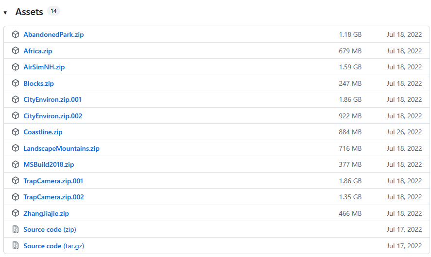
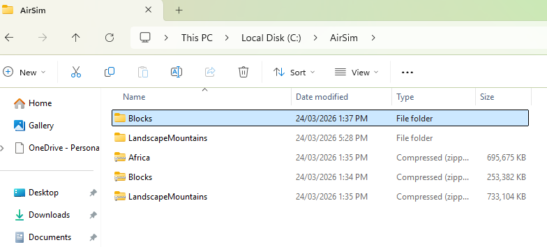
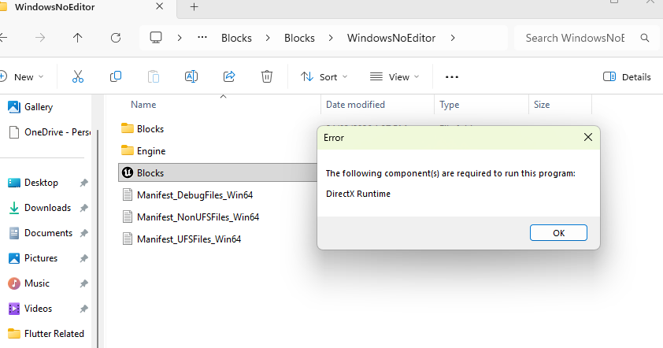
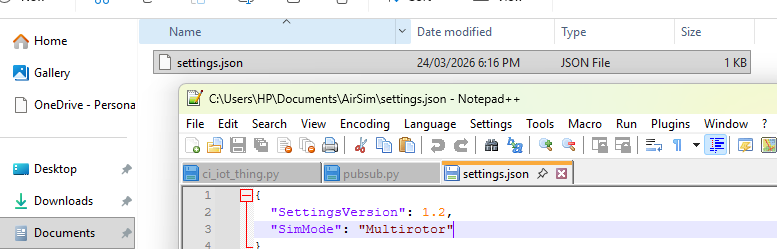
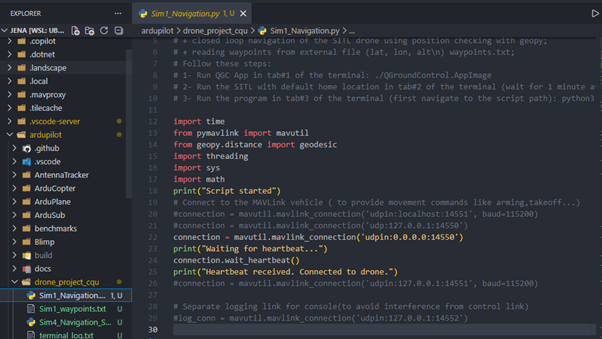
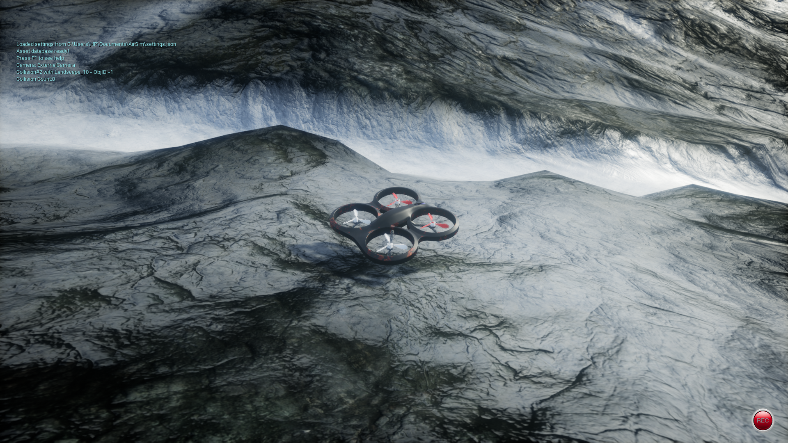

**I downloaded Airm Relases from official AirSim github web** - 

https://github.com/Microsoft/AirSim/releases

During the initial attempt to launch the AirSim environment (Landscape/Blocks), I encountered an error message indicating that a required component was missing:

[I encountered another issue](./screenshots/UDP_socket_bind_error.png)

This error was related to network configuration, specifically the IP address binding used for communication between AirSim and ArduPilot SITL. The issue occurred because the IP address defined in the AirSim settings.json file was not valid or not accessible in my 
system configuration.

To resolve this, I modified the settings.json file to use a local and valid loopback address. 

**Python Script Modification After AirSim Configuration**

After configuring the AirSim settings.json file to enable communication with ArduPilot using the correct UDP IP and port, it was also necessary to update the Python navigation script to ensure proper connection with the simulated drone.

I added confirmation print statements to verify the connection process:
Print(“Script started”)
Print(“Waiting for heartbeat…”)
Connection.wait_heartbeat()
Print(“Heartbeat received. Connected to drone.”)
These messages helped confirm that the script was successfully receiving data from the drone and that the communication link was established correctly.

**Through these steps, I have done Basic Simulator Setup**

