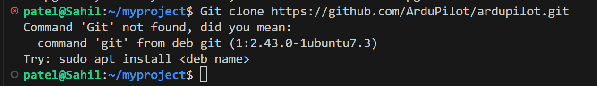
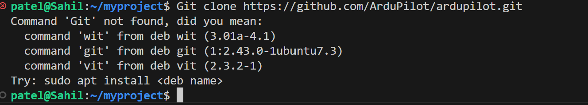
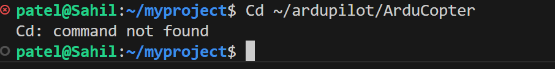
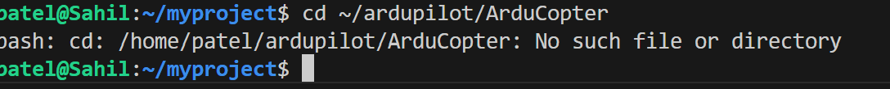
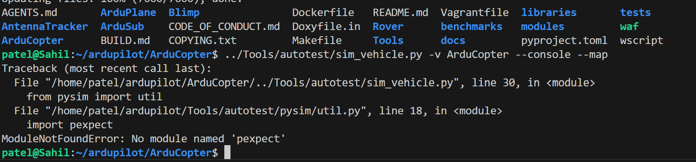
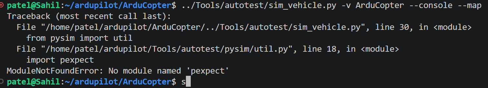
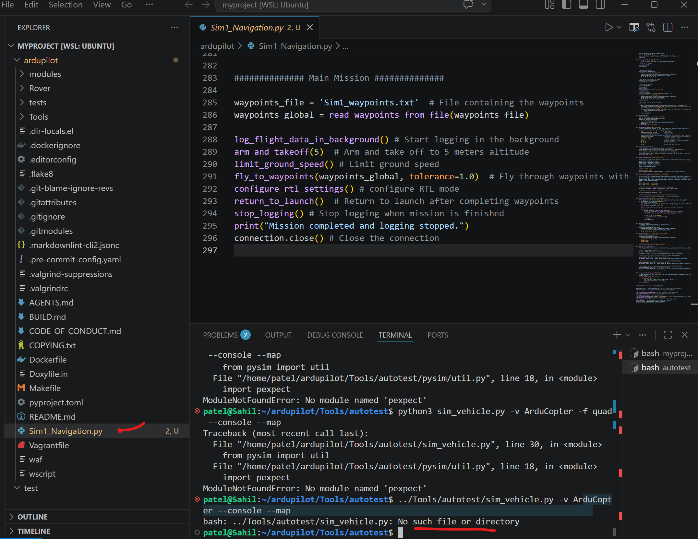
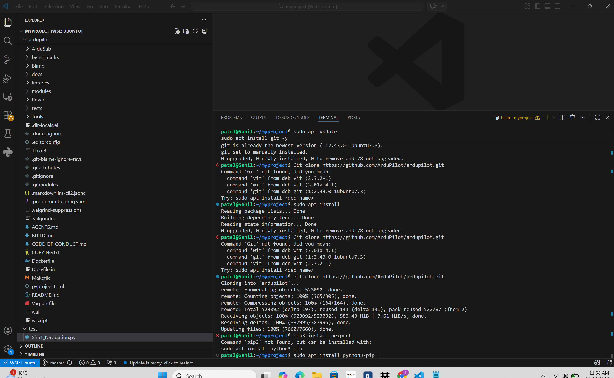
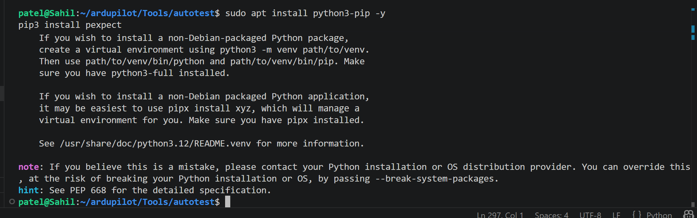
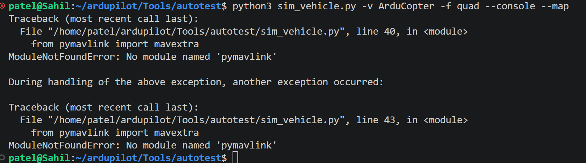

# Capstone Project – My Contribution

Prepared by: Sahil Patel

---

## Overview
This repository presents my individual contribution to the Capstone Project, focusing on the setup and configuration of AirSim and ArduPilot simulation environment.

---

## My Work Evidence

### VS Code & Initial Setup
This section shows the initial setup and configuration of the development environment.

---

### Simulation and Configuration Progress
These screenshots demonstrate the step-by-step progress of AirSim and ArduPilot integration.

---

### Error Handling & Troubleshooting
This section highlights errors encountered during setup and how they were identified and resolved.

---

### Python & MAVLink Setup
These screenshots show Python environment setup and pymavlink configuration.

---

## Conclusion
The above screenshots clearly demonstrate my active involvement in setting up, troubleshooting, and successfully configuring the simulation environment for the Capstone Project.
