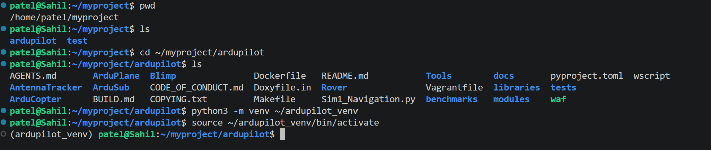
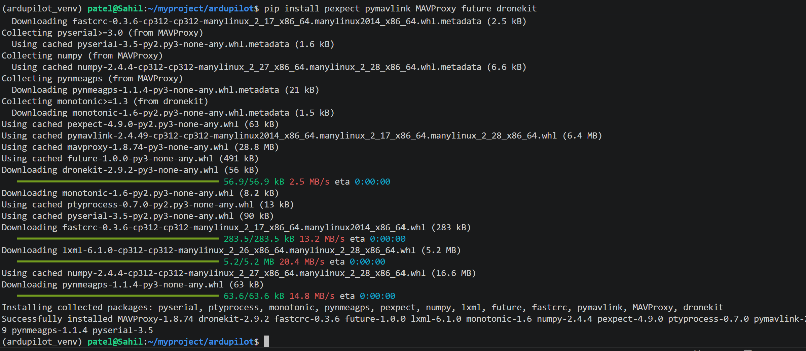
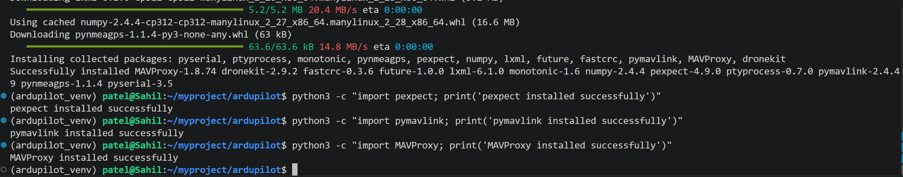
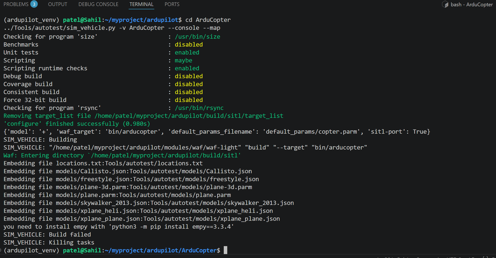
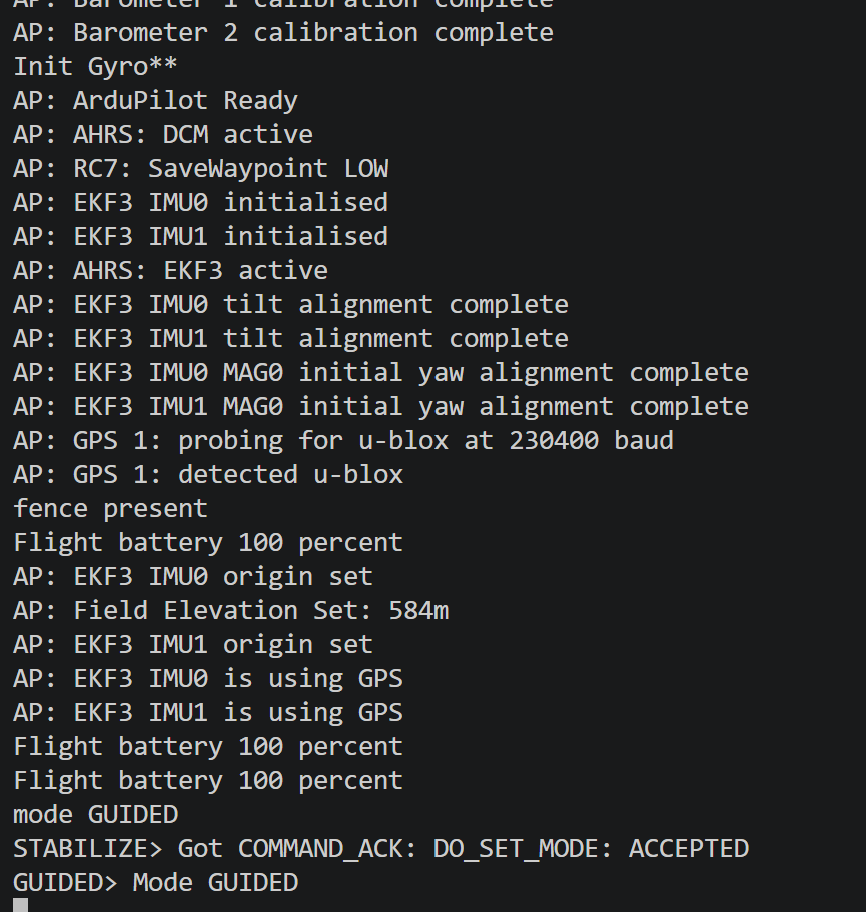
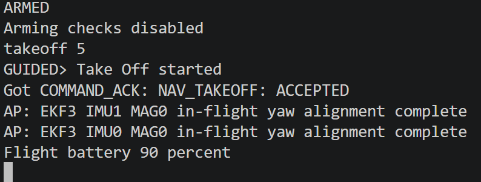
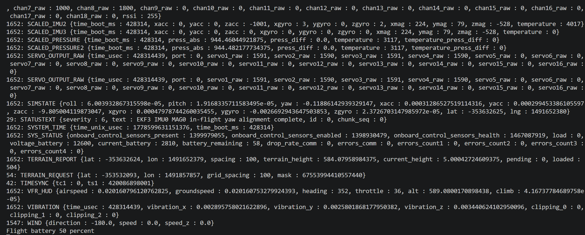
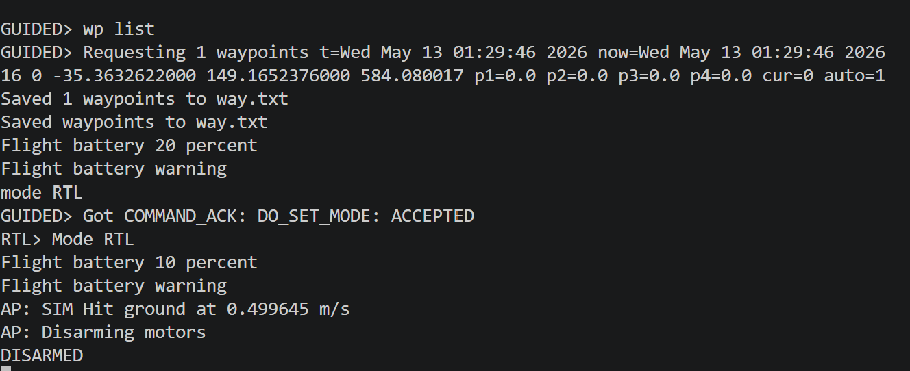

# Capstone Project – My Contribution

Prepared by: Sahil Patel

---

## Overview
This repository presents my individual contribution to the Capstone Project, focusing on the setup and configuration of AirSim and ArduPilot simulation environment.

---

## My Work Evidence

### VS Code & Initial Setup
This section shows the initial setup and configuration of the development environment.

---

### Simulation and Configuration Progress
These screenshots demonstrate the step-by-step progress of AirSim and ArduPilot integration.

---

### Error Handling & Troubleshooting
This section highlights errors encountered during setup and how they were identified and resolved.

---

### Python & MAVLink Setup
These screenshots show Python environment setup and pymavlink configuration.

---

---

# Advanced Drone Simulation & Validation Work

This section presents my latest practical testing and validation work completed after the initial setup stage.

## 1. Python Virtual Environment Configuration

A dedicated Python virtual environment was created to isolate project dependencies and support stable ArduPilot simulation testing.

**Validation Result:**  
✅ Python virtual environment configured successfully  
✅ Simulation workspace prepared  

---

## 2. MAVProxy and MAVLink Dependency Installation

Required MAVLink communication libraries and simulation dependencies were installed successfully, including `pexpect`, `pymavlink`, `MAVProxy`, `dronekit`, and `future`.

**Validation Result:**  
✅ MAVProxy installed successfully  
✅ pymavlink configured correctly  
✅ Drone communication libraries operational  

---

## 3. SITL Simulation Build and Startup

The ArduPilot SITL simulation environment was configured and launched successfully.

**Validation Result:**  
✅ SITL build process validated  
✅ Drone simulation environment operational  
✅ MAVProxy simulation connection successful  

---

## 4. GUIDED Mode Validation

Drone control mode testing was performed through MAVProxy command validation.

**Validation Result:**  
✅ GUIDED mode functioning correctly  
✅ MAVLink command acknowledgment received  
✅ Flight control communication validated  

---

## 5. Autonomous Takeoff Testing

Autonomous drone takeoff testing was performed using MAVProxy commands:

**Validation Result:**  
✅ Drone armed successfully  
✅ Autonomous takeoff accepted  
✅ Flight state transition validated  

---

## 6. Live Telemetry and Sensor Monitoring

Real-time MAVLink telemetry and drone sensor information were monitored during simulation testing.

**Validation Result:**  
✅ Real-time telemetry operational  
✅ Sensor communication validated  
✅ Flight monitoring successful  

---

## 7. Waypoint and RTL Validation

Waypoint communication and Return-To-Launch functionality were tested successfully.

**Validation Result:**  
✅ Waypoint communication operational  
✅ RTL mode validated successfully  
✅ Autonomous landing completed  
✅ Motors disarmed correctly  

---

## 8. AI Weed Detection Environment Preparation

The AI/computer vision environment required for weed detection testing was successfully configured using Ultralytics YOLO, OpenCV, and related Python libraries.

**Validation Result:**  
✅ Ultralytics YOLO installed successfully  
✅ OpenCV image-processing environment configured  
✅ AI weed-detection testing environment prepared  
✅ Computer vision pipeline dependencies validated  

---

## Overall Latest Contribution Summary

This additional work demonstrates practical testing and validation of:

- ArduPilot SITL simulation
- MAVProxy communication
- MAVLink telemetry
- autonomous takeoff
- waypoint handling
- RTL landing
- dependency troubleshooting
- AI environment setup
- weed-detection pipeline preparation
- simulation readiness for future weed detection integration

The latest testing confirms that the drone simulation and control pipeline is operational at SITL level and ready for further AI-based weed detection integration.
