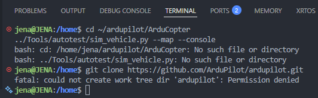
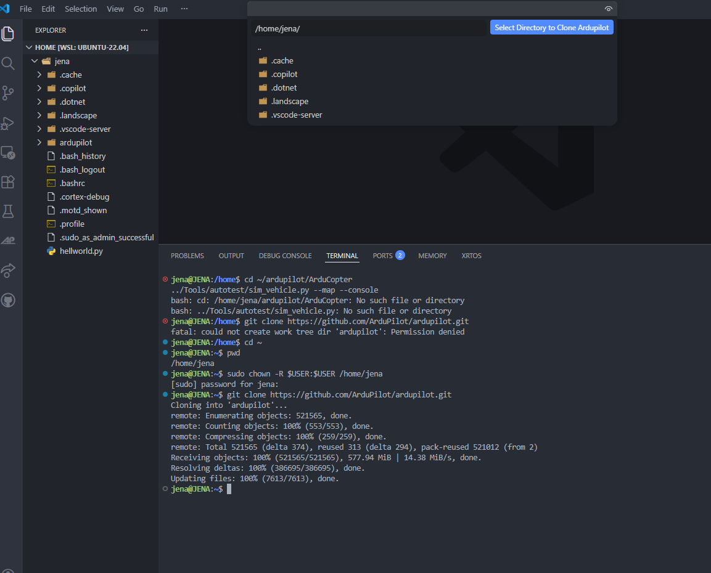
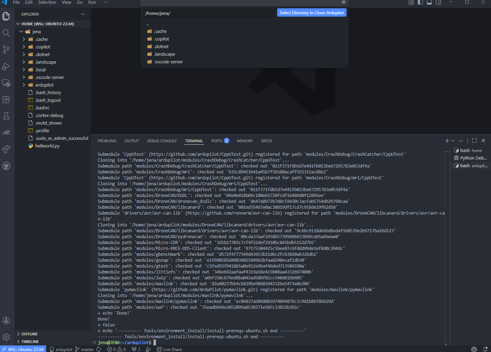
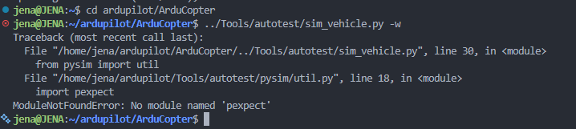
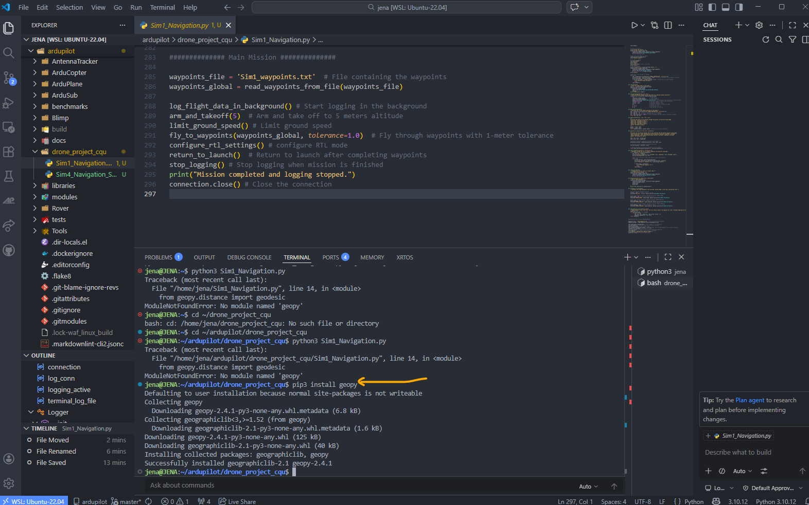
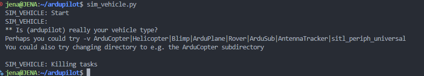
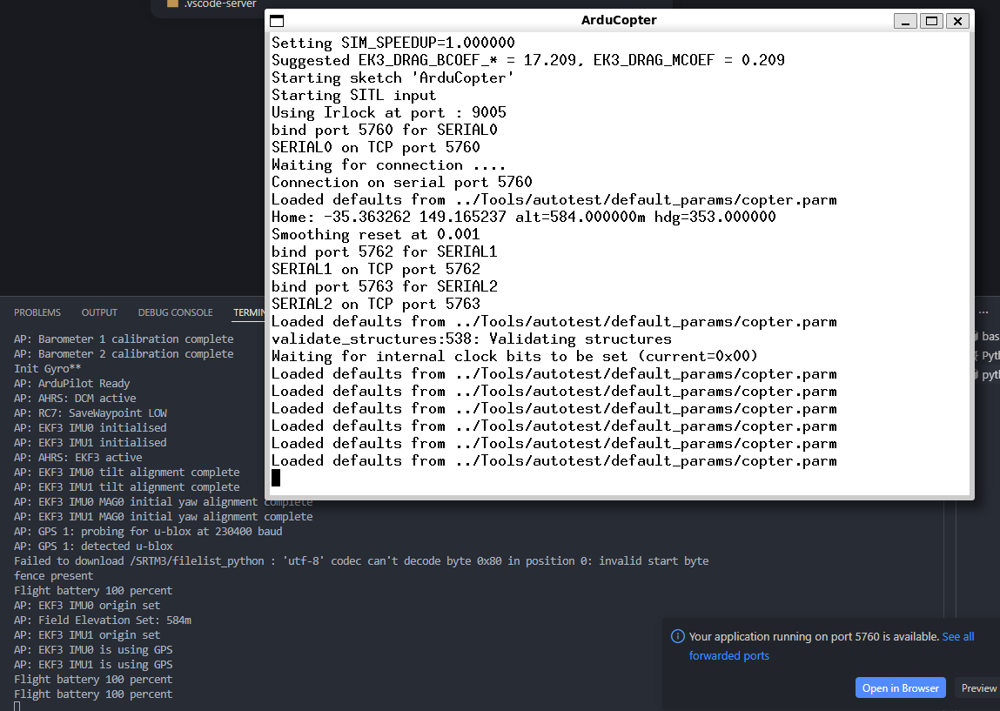
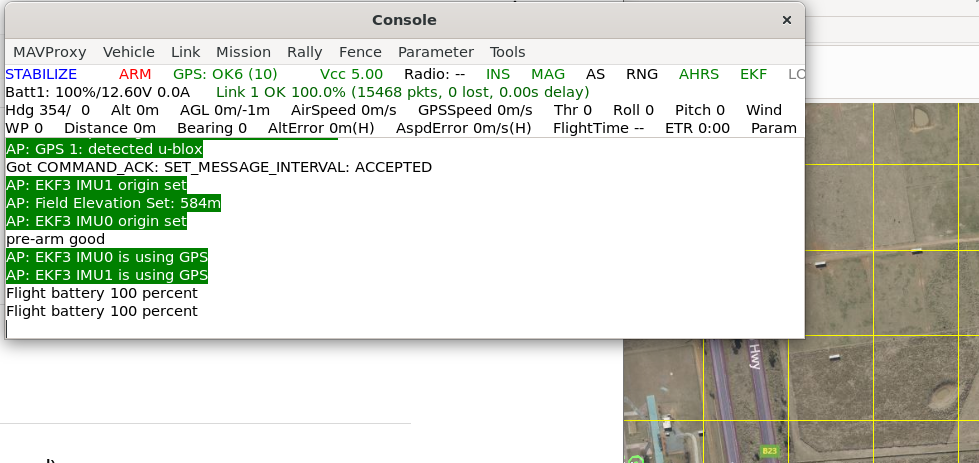
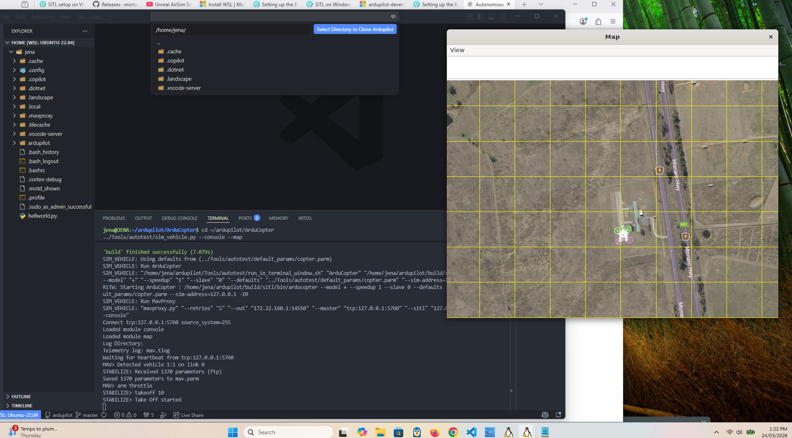

I have done the process of setting up the Ardupilot, AirSim, and simulation as well. I've uploaded the screenshots too.

**https://learn.microsoft.com/en-us/windows/wsl/install**

**Step 1:**

-----------------------
**Step 2**

-----------------------

**Step 3**

------------------------
**Step 4 Installing Ardupilot extension for VS Code.**

------------------------
**Step 5**

---------------------------
**verify the folder or directories using the command**

During the setup of the ArduPilot SITL environment, I encountered several technical issues related to file paths, permissions, and missing dependencies. These errors were important learning points and helped me better understand how the system operates. 
Initially, when attempting to run the simulation using: 

**"./Tools/autotest/sim_vehicle.py --map –console"**

**"Sudo chown -R $USER:$USER /home/jena"**

We need to enter our wsl password to finish the installation and to Clone ArduPilot properly, I used this command and successfully done. 

**"Git clone https://github.com/ArduPilot/ardupilot.git"**

------------------------------

-----------------------------

**Geospy Python error**

After successfully navigating to the correct directory, I attempted to run the simulation again. This time, I encountered a Python error

I resolved this issue by installing the required package using these commands **"pip3 install pexpect"** and **"pip3 install geospy"**

----------------------------------

This error occurred because I executed the simulation command from the wrong directory level. The system could not determine which vehicle type to simulate.

I fixed this issue with the command **"Cd ~/ardupilot/ArduCopter"** And rerunning the command, the simulation started successfully. 

