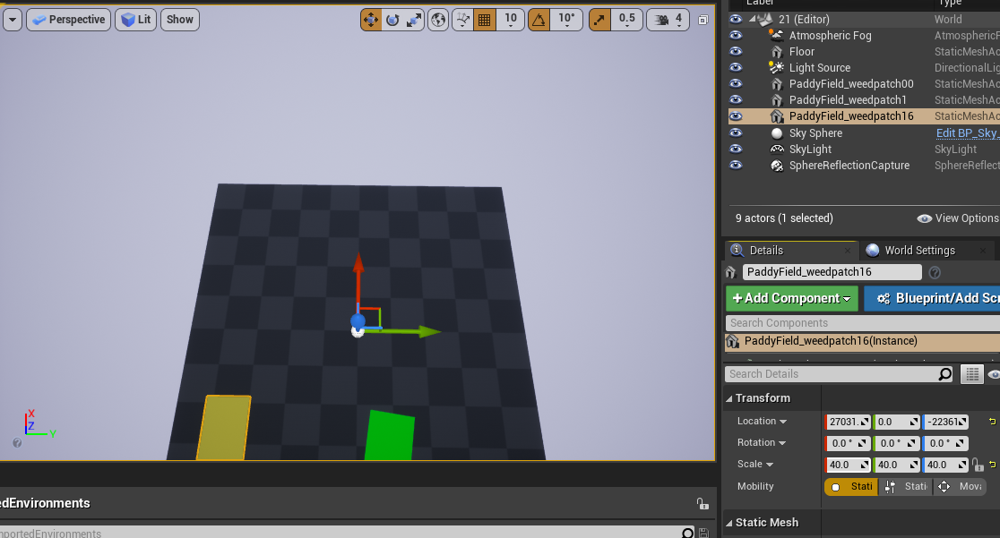
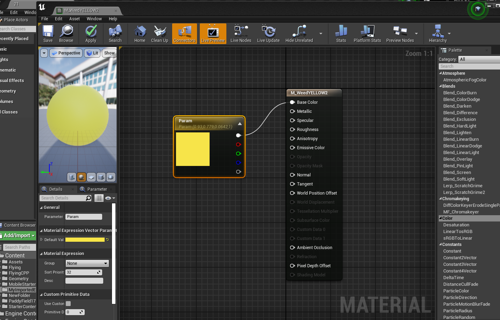
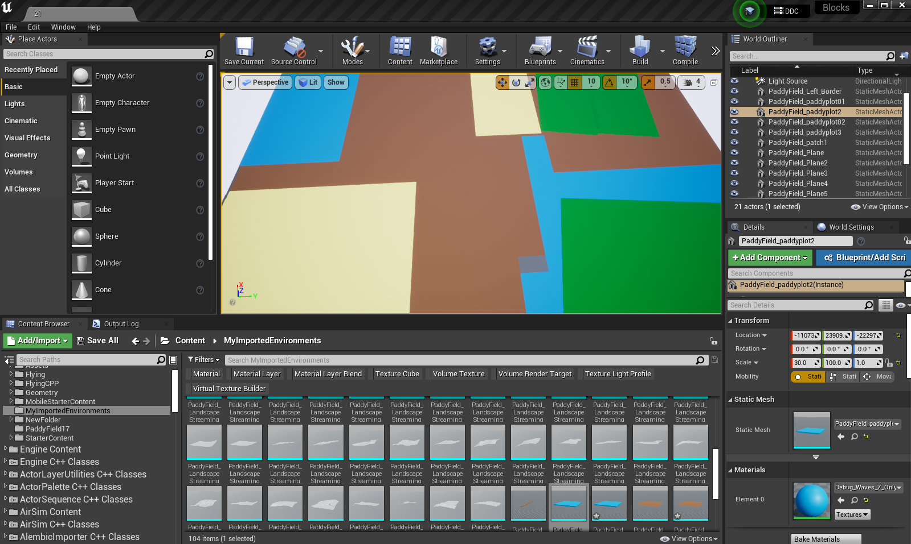
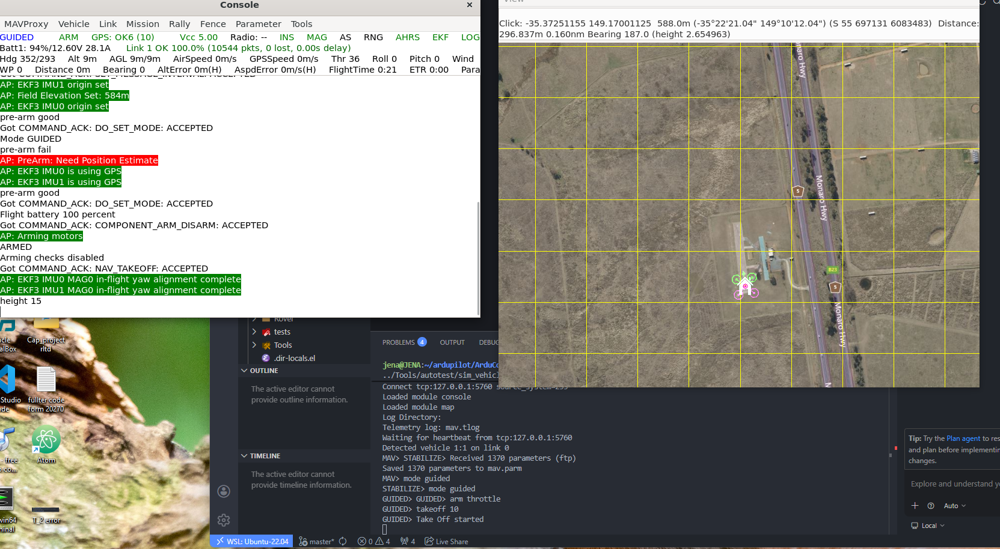
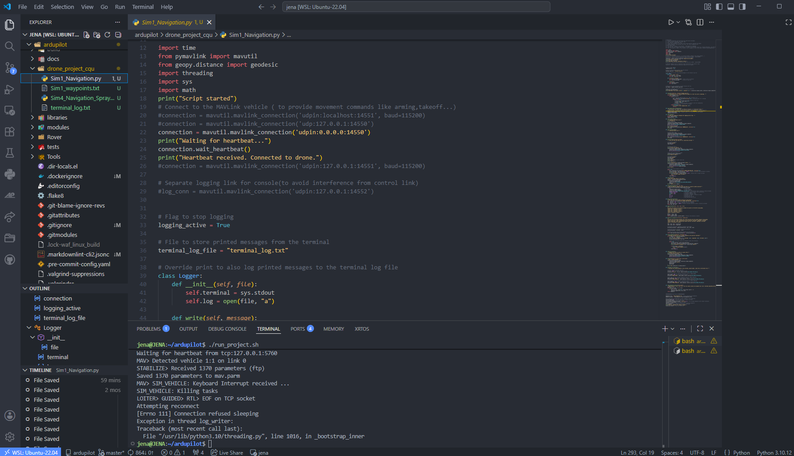
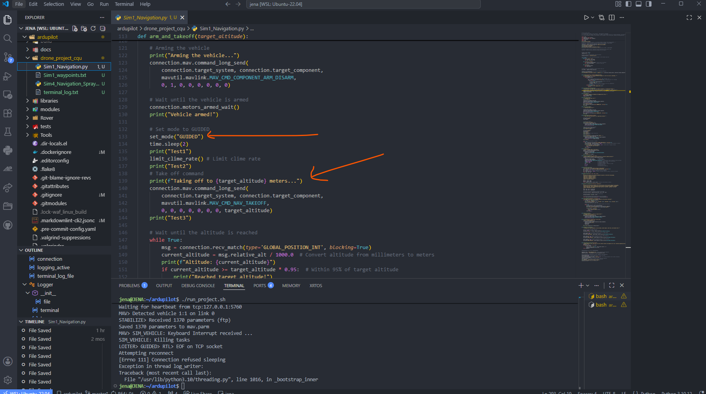
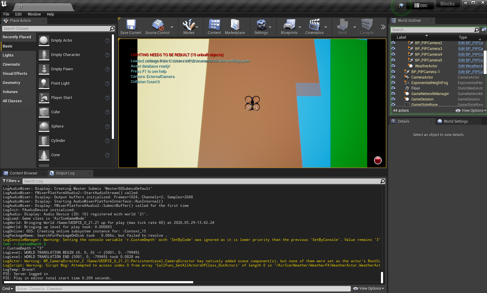

# Environment Development Progress

## Overview

The environment development phase focused on creating and configuring a realistic agricultural simulation environment for testing an autonomous drone weed detection and spraying system. The objective was to establish a virtual paddy field environment that can be integrated with AirSim, Unreal Engine, and ArduPilot SITL for autonomous flight testing and future computer vision development.

---

## Unreal Engine Setup

Unreal Engine 4.27 was installed and configured as the primary simulation platform. Visual Studio Community 2022 was installed together with the required C++ development tools to support Unreal Engine project compilation and plugin integration.

The AirSim plugin was integrated into the Unreal Engine environment to provide drone simulation capabilities and communication with external control systems. Several sample environments, including Blocks and Landscape Mountains, were successfully tested to verify correct AirSim operation.

---

## AirSim Integration

Microsoft AirSim was configured within the Unreal Engine project to simulate multirotor drone operations. The AirSim settings file was modified to support multirotor flight and communication with external control software.

The following components were successfully configured:

* AirSim plugin integration
* Multirotor drone simulation
* Camera sensor simulation
* Python API communication
* Unreal Engine environment interaction

---

## ArduPilot SITL Configuration

ArduPilot Software-In-The-Loop (SITL) was installed and configured using Windows Subsystem for Linux (WSL Ubuntu 22.04).

The SITL environment provides a realistic autopilot simulation that allows autonomous flight control testing without physical hardware.

The following tools were configured:

* ArduPilot SITL
* MAVProxy
* MAVLink communication
* GPS simulation
* Flight telemetry monitoring

---

## MAVProxy Console and Map

MAVProxy was successfully configured to provide real-time telemetry monitoring and mission control.

Features verified include:

* Vehicle status monitoring
* GPS information display
* Flight mode management
* MAVLink communication
* Interactive map visualization
* Mission command execution

The map interface displays the simulated drone position and enables future waypoint navigation and mission planning.

---

## Paddy Field Environment Development

A custom paddy field simulation environment is currently under development by the project team. Environment assets and landscape components are being prepared and integrated into Unreal Engine.

---------------------------

--------------------------

Current development activities include:

* Landscape creation
* Agricultural field modelling
* Terrain adjustment
* Environment asset integration
* Simulation testing within AirSim

The environment will be used to evaluate autonomous drone navigation, weed detection algorithms, and spraying operations.

---
## Drone Control Testing

Initial drone control testing was conducted using MAVProxy commands and Python scripts.

Basic flight commands successfully tested include:

mode GUIDED
arm throttle
takeoff 10

The drone was able to:

Arm successfully
Take off autonomously
Maintain altitude
Receive navigation commands
Land safely

These tests verified the communication chain between the simulation components.

----------
## Python Integration

Python was selected as the primary programming language for automation and future computer vision integration.

The Python environment was configured with:

pymavlink
AirSim API
OpenCV
NumPy

Python scripts were used to:

Connect to AirSim
Control drone movement
Test autonomous flight sequences
Prepare for future weed detection integration

-------------

## Current Achievements

The following milestones have been completed:

* Unreal Engine installed and configured
* Visual Studio integration completed
* AirSim successfully compiled and deployed
* Drone simulation verified within Unreal Engine
* ArduPilot SITL configured and operational
* MAVProxy console and map functioning correctly
* Python-based drone control tested
* Initial environment assets integrated

---

## Future Work

The next stage of development will focus on:

1. Completing the paddy field environment.
2. Integrating YOLO-based weed detection models.
3. Implementing autonomous waypoint navigation.
4. Developing spraying simulation logic.
5. Performing system integration testing.
6. Evaluating weed detection accuracy and navigation performance.

---

## Technologies Used

* Unreal Engine 4.27
* Microsoft AirSim
* ArduPilot SITL
* MAVProxy
* MAVLink
* Python
* Visual Studio 2022
* WSL Ubuntu 22.04
* OpenCV
* YOLO Object Detection

## Project Status

🚧 Environment Development In Progress

The simulation infrastructure has been successfully established, and work is currently progressing on the development and integration of a realistic paddy field environment for autonomous drone testing.
