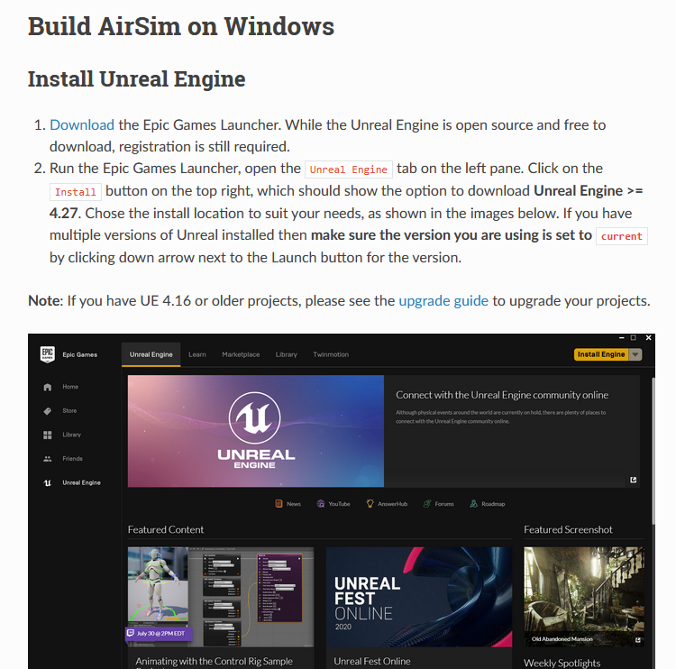
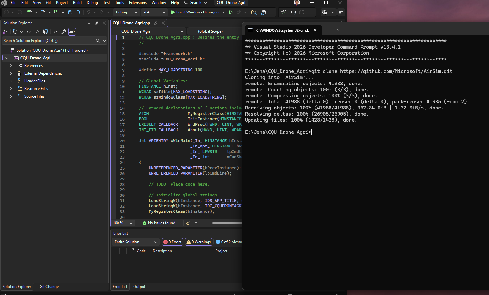

**Progress on Building AirSim Environment (Windows)**

During this phase of the project, I focused on setting up and building the AirSim simulation environment on a Windows system.

-----------------------

**Step1:** During this phase of the project, I focused on setting up and building the AirSim simulation environment on a Windows system. I began by cloning the AirSim repository using the Visual Studio Developer Command Prompt, which ensured that all required environment variables were correctly configured. The cloning process completed successfully, confirming that the repository and its dependencies were properly downloaded.

