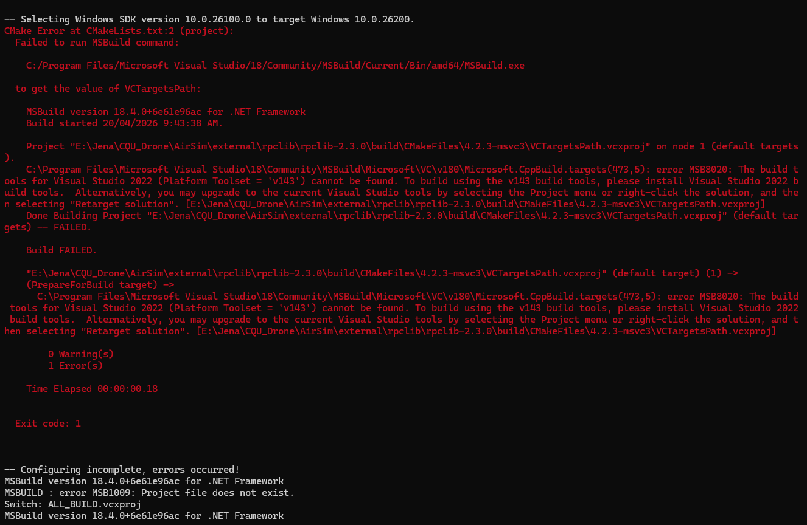
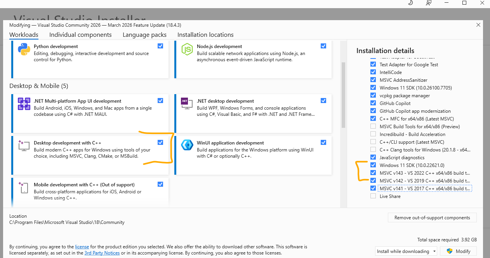
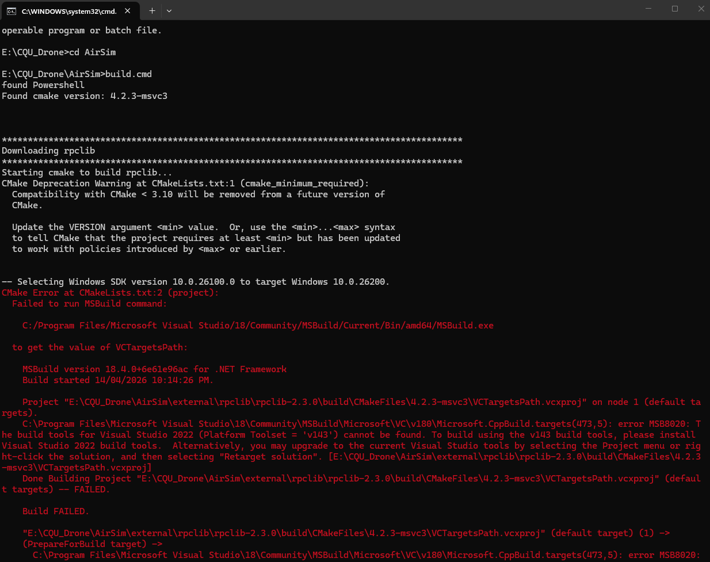

**Progress on Building AirSim Environment (Windows)**


During this phase of the project, I focused on setting up and building the AirSim simulation environment on a Windows system.

-----------------------

**Step1:** During this phase of the project, I focused on setting up and building the AirSim simulation environment on a Windows system. I began by cloning the AirSim repository using the Visual Studio Developer Command Prompt, which ensured that all required environment variables were correctly configured. The cloning process completed successfully, confirming that the repository and its dependencies were properly downloaded.


-------------------------

**Step2** **During this phase I got an error "AirSim is trying to build with Platform Toolset v143, but MSBuild still cannot find that toolset on your machine"**


The v143 C++ build tools are not actually installed Visual Studio can be installed, but the exact C++ toolset AirSim needs may still be missing. Microsoft’s MSB8020 docs say this error appears when the required platform toolset is not installed or its folder does not exist.



**Step3 Necessary Tools installation on Visual Studio under Desktop development with C++**



In addition to the main workload, specific build tools and SDK components were verified and selected, including the Windows 11 SDK and multiple versions of the MSVC toolset (v143, v142, and v141). This step was particularly important to ensure compatibility with AirSim’s build requirements, as certain dependencies such as rpclib rely on specific platform toolsets.


# AirSim Build Failure on Windows — Missing Visual Studio v143 Toolset

## Summary

Attempting to build AirSim on Windows fails during the `rpclib` compilation stage due to a missing Visual Studio C++ toolset (`v143`).

The build process successfully detects:

- PowerShell
- CMake (`4.2.3-msvc3`)
- Windows SDK (`10.0.26100.0`)

However, MSBuild fails because the required Visual Studio 2022 C++ build tools are not installed.

---

# Environment

| Component | Version |
|---|---|
| OS | Windows |
| Visual Studio | Visual Studio Community 2022 |
| CMake | 4.2.3-msvc3 |
| AirSim Path | `E:\CQU_Drone\AirSim` |

---


cd E:\CQU_Drone\AirSim
build.cmd

---------------------------


The Visual Studio Developer Command Prompt environment was successfully initialized, and the Microsoft AirSim repository was cloned successfully from GitHub without errors.

This confirms that the development environment is correctly configured for Git operations and C++ development tooling.

# Environment Details

| Component | Status |
|---|---|
| Visual Studio Developer Command Prompt | Initialized Successfully |
| Git | Working |
| MSBuild | Available |
| AirSim Repository | Cloned Successfully |
| Windows SDK Environment | Loaded |
| Developer Tools Paths | Configured |

---

# Command Executed

```bash
git clone https://github.com/Microsoft/AirSim.git

---------------
