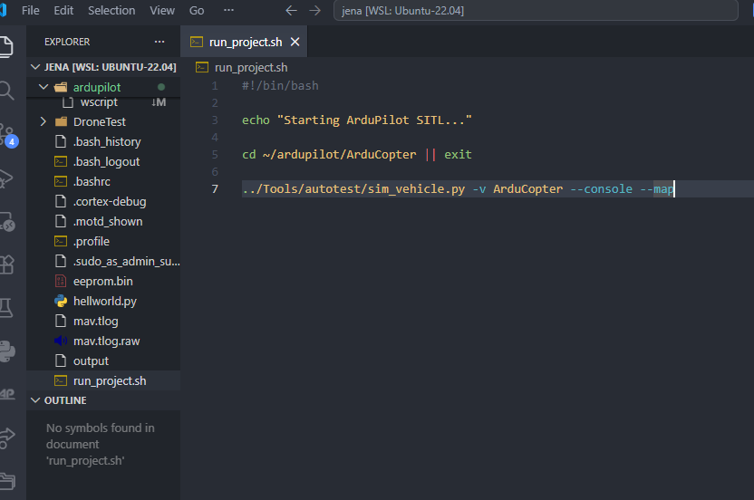

# Shell File Creation for ArduPilot SITL and Navigation Script

## Overview

In This section I explain the Steps I followed to simulation easier and quickest by creating shell scripts in WSL (Windows Subsystem for linux) used to simplify the execution process of the ArduPilot SITL simulation and the Python-based drone navigation program. Instead of manually typing long commands every time, shell files were created to automate the startup process.

The shell scripts help to run the simulation in a more organised and repeatable way. This is useful for testing, demonstration, and project documentation.

---


## Purpose of Creating Shell Files

Initially, the ArduPilot SITL simulation and navigation script had to be started manually using terminal commands. This process required changing directories and typing multiple commands each time.

To improve the workflow, shell scripts were created for:

* Starting the ArduPilot SITL simulation
* Opening MAVProxy console and map
* Automatically forwarding MAVLink output to the navigation script
* Running the Python navigation file from the correct project folder

This makes the project easier to run and reduces typing mistakes.

---

## Shell Script for ArduPilot SITL

The first shell file was created inside the ArduPilot directory.

File name:

**run_project.sh**

The purpose of this file is to start ArduPilot SITL for the ArduCopter vehicle.

#!/bin/bash

echo "Starting ArduPilot SITL..."

cd ~/ardupilot/ArduCopter || exit

../Tools/autotest/sim_vehicle.py \
    -v ArduCopter \
    --console \
    --map \
    --out=127.0.0.1:14550


The `--console` option opens the MAVProxy console, and the `--map` option opens the map window. The `--out=127.0.0.1:14550` option automatically forwards MAVLink data to port `14550`, which is used by the Python navigation script.

---

## Making the Shell File Executable

After creating the shell file, permission was given using the following command:


**chmod +x run_project.sh**


Then the script was executed using:


**./run_project.sh**


Once executed, ArduPilot SITL started successfully, and MAVProxy console and map windows opened.


---

## Shell Script for Navigation Program

A second shell script was created to run the Python navigation script.

File name:

```bash
run_navigation.sh
```

This script changes directory to the drone project folder and runs the Python file.

```bash
#!/bin/bash

echo "Starting Navigation Script..."

cd ~/ardupilot/drone_project_cqu || exit

python3 Sim1_Navigation.py
```

The file was also made executable:

```bash
chmod +x run_navigation.sh
```

The navigation script can then be started using:

```bash
./run_navigation.sh
```


---

## Automation of MAVLink Output

Previously, MAVProxy required the following command to be entered manually:

```text
output add 127.0.0.1:14550
```

This was required so the Python navigation program could receive MAVLink messages from ArduPilot SITL.

Later, this step was automated by adding the following option to `run_project.sh`:

```bash
--out=127.0.0.1:14550
```

Because of this improvement, the output connection is now created automatically when SITL starts.

---

## Navigation Script Behaviour

The Python navigation script connects to the MAVLink output port and controls the drone automatically. It performs the following operations:

1. Connects to the drone through MAVLink
2. Waits for heartbeat
3. Sets the flight mode
4. Arms the drone
5. Performs take-off
6. Reads waypoints from a text file
7. Flies through the waypoint list
8. Returns to launch after completing the mission

This means manual commands such as `mode guided`, `arm throttle`, and `takeoff` are not required because they are already handled inside the Python script.

---

## Pre-Arm Position Estimate Issue

During testing, the drone sometimes stopped at the arming stage. The MAVProxy console showed the message:

```text
PreArm: Need Position Estimate
```

This means ArduPilot had not yet completed its GPS/EKF position estimation. The drone cannot arm until the position estimate becomes valid.

To avoid this issue, the simulation should be given enough time to initialise before running the navigation script. Waiting around 30 to 60 seconds after starting SITL usually solves the problem.


---

## Setting ArduPilot as Default WSL Folder

To make the workflow faster, the WSL terminal was configured to open directly inside the ArduPilot folder.

The following lines were added at the end of the `.bashrc` file:

```bash
# to make ardupilot default
if [ "$PWD" = "$HOME" ]; then
    cd ~/ardupilot
fi
```

After this change, every new WSL terminal automatically opens at:

```bash
~/ardupilot
```

This saves time because the shell scripts can be executed immediately.

---

## Final Execution Workflow

The final workflow is simple and organised.

### Terminal 1

```bash
./run_project.sh
```

This starts ArduPilot SITL, MAVProxy console, map, and MAVLink output forwarding.

### Terminal 2

```bash
./run_navigation.sh
```

This starts the autonomous navigation script.

---

## Summary

Shell scripts were successfully created to automate the execution of ArduPilot SITL and the Python navigation program. The `run_project.sh` script starts the simulation environment, while the `run_navigation.sh` script starts the navigation logic.

This improves the project workflow by reducing manual command entry, avoiding repeated mistakes, and making the system easier to demonstrate. The automation also supports the overall drone simulation pipeline by connecting ArduPilot SITL with the Python-based navigation system through MAVLink.
